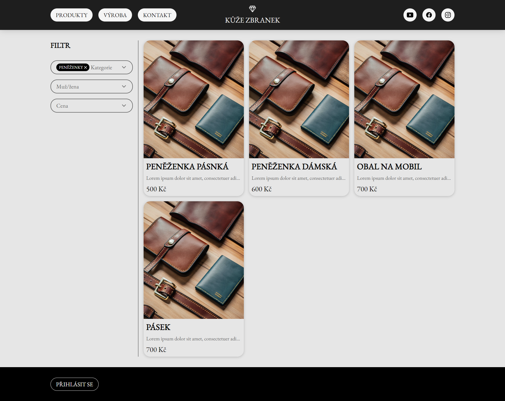
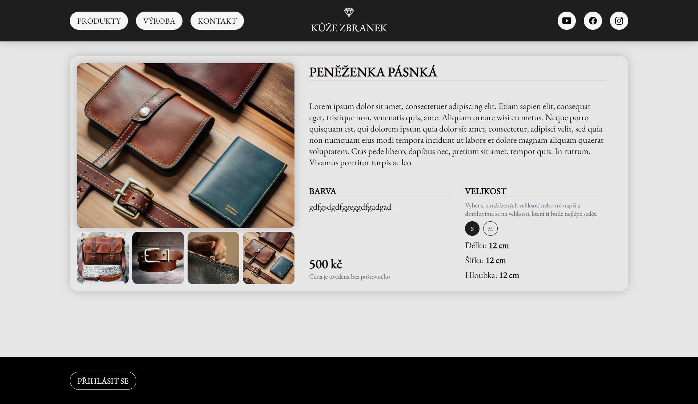

# Name
Leather goods e-shoop

# Description
Just some e-shop design ideas for future real leather business project.  
Backend: **Node.js**, **express**  
Database: **MySQL on localhost** (just for testing and development)  
Fetching: **axios**  
User management: **Redux**  
Filters: **react-context**  
Images are some jpegs, pngs and webps. They are there just for illustraion...

## Instalation
1. ```git clone https://github.com/YourUsername/React-eshop.git```
2. navigate to app folder ```cd app```
3. install dependencies ```npm install```
4. frontend run ```npm start```
5. on Windowns go to services and run MySQL
6. backend run ```npm run start:backend```

## Current state
  
  


## ToDo
1. work on design
2. price filter rework to slider
3. add admin features(adding/removing/editing items)
4. build and release
