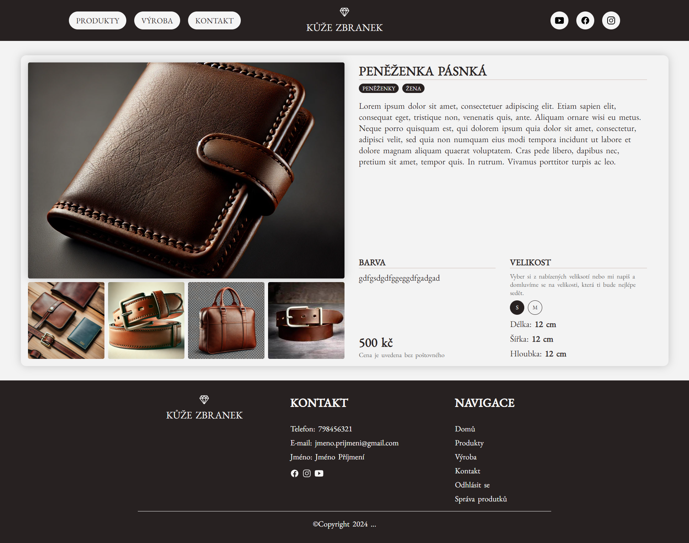

# Name
Leather products e-shoop

# Description
Just some e-shop design ideas for future real leather business project.  
Backend: **Node.js**, **express**  
Database: **MySQL on localhost** (just for testing and development)  
Fetching: **axios**  
User management: **Redux**  
Filters: **react-context**  
Images are some jpegs, pngs and webps. They are there just for illustraion... Some pictures are generated by AI

## Instalation
1. ```git clone https://github.com/YourUsername/React-eshop.git```
2. navigate to app folder ```cd app```
3. install dependencies ```npm install```
4. frontend run ```npm start```
5. on Windowns go to services and run MySQL
6. backend run ```npm run start:backend```

## Current state  
1. At this point there is no shopping cart. Maybe in the future, but first thought was to get product by phone or email.
2. Admin can log-in. Authentication token has some expiration time, so user is automatically logged-out. Or if there is no user activity for some time, user is also logged-out.  
3. Visitor can browse products and open product detail page. There is posibility to switch between product sizes. At this moment, there is no option to add product to cart.  
4. Contact form should send message to my email address.
5. On the admin page there are two modules (edit products, create new product). Working on it...

  
  




## ToDo
1. work on design
2. price filter rework to slider
3. add admin features(adding/removing/editing items)
4. build and release
